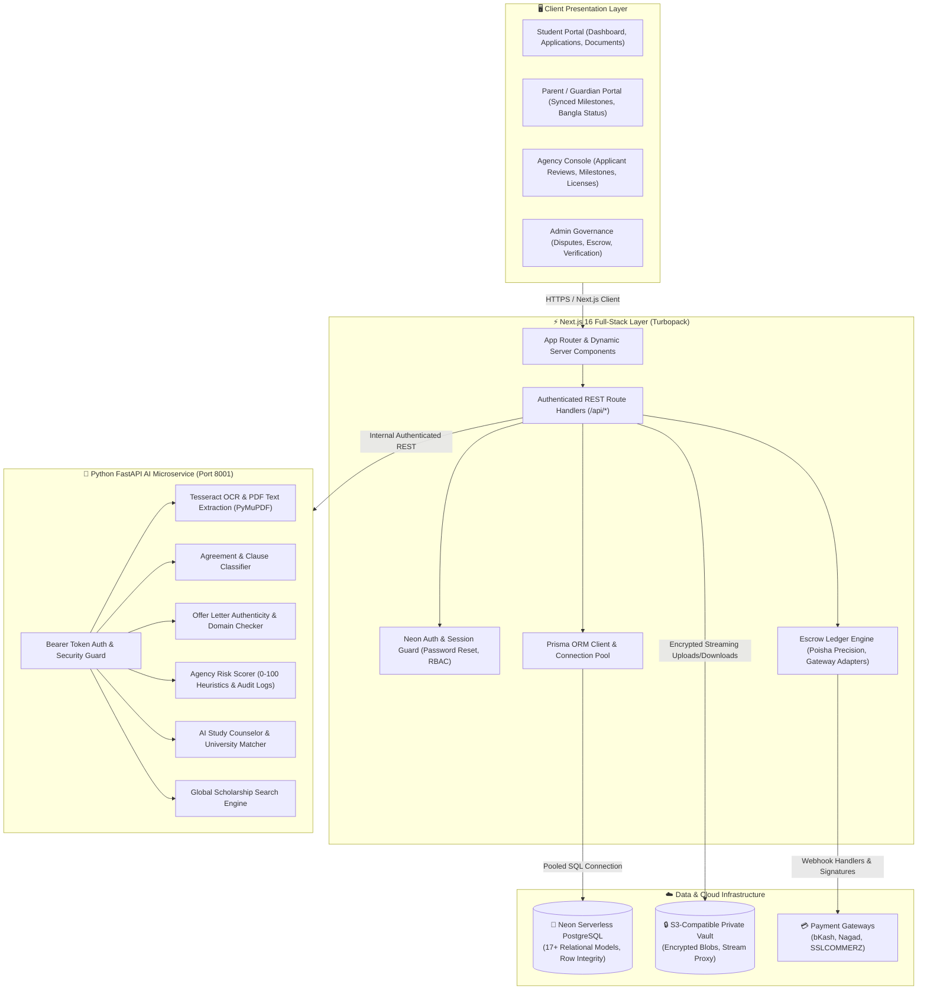

# 🎓 Ethos AI — The Future of Study-Abroad Consulting

<div align="center">

[-black?style=for-the-badge&logo=next.js)](https://nextjs.org/)
[](https://react.dev/)
[](https://www.typescriptlang.org/)
[](https://fastapi.tiangolo.com/)
[](https://neon.tech/)
[](https://www.prisma.io/)
[](https://vitest.dev/)
[](https://www.uiu.ac.bd/)

**A Trust, Security & Milestone Escrow Platform Protecting Bangladeshi Students & Parents from Predatory Consultancies**

[Explore Features](#-key-features--module-breakdown) • [System Architecture](#%EF%B8%8F-system-architecture) • [Getting Started](#-getting-started-local-development) • [Team Contributions](#-team-members--task-distribution) • [Test Suite](#-testing--quality-assurance)

</div>

---

## 📌 Executive Summary & Value Proposition

Every year, over **70,000–90,000 Bangladeshi students** apply to foreign higher education institutions. Without a mandatory national licensing and consumer protection regime, students and their families face systemic exploitation:
- **Predatory Upfront Fees:** Unregulated consultants demand 100% upfront fees without guaranteed outcomes.
- **Hidden Charges & Trap Clauses:** Contracts contain fine-print clauses forfeiting entire deposits upon visa or offer rejection.
- **Forged Acceptance Letters:** Vulnerable students receive fake offer letters with falsified university credentials.
- **Zero Recourse & Lack of Transparency:** Parents are kept in the dark without real-time tracking, dual-language visibility, or dispute mechanisms.

**Ethos AI** solves this through an end-to-end trust infrastructure combining **verified consultancy directories**, **side-by-side fee comparison**, **milestone-based escrow payment vaults**, **AI-driven document and agreement fraud detection**, and **parent guardian linking**.

---

## 🏗️ System Architecture

Ethos AI is built as a cloud-native dual-service architecture: a high-performance **Next.js 16 Web Application** paired with a dedicated **FastAPI AI Microservice**, backed by **Neon Serverless PostgreSQL** and an **S3-compatible private document storage vault**.



---

## 🚀 Key Features & Module Breakdown

### 🔐 1. Identity, RBAC & Guardian Linking (Module 5.1)
- **Role-Based Access Control:** Dedicated dashboards tailored for **Student**, **Parent**, **Agency**, and **Admin**.
- **Guardian Account Linking:** Instant parent-to-student synchronization via unique security codes (e.g. `ETHOS-STU-8821`) providing parents with non-technical Bengali status updates and real-time payment alerts.
- **Neon Auth & Secure Password Recovery:** Tokenized password reset flow with cryptographic expiration and tamper-resistant state validation.

### 🏢 2. Verified Agency Directory & Pricing Transparency (Modules 5.2, 5.3 & 5.4)
- **Official Licensing Registry:** Government license verification status (`MOE-BD-*`), year founded, and validated office locations.
- **Side-by-Side Comparison Engine:** Compare up to 4 agencies simultaneously on success rates, average costs, refund policies, and verified alumni reviews.
- **Published Fee Schedules:** Mandatory itemized breakdown of consultancy fees in Bangladeshi Taka (BDT) preventing unexpected hidden charges.

### 📂 3. End-to-End Application Lifecycle & Document Vault (Modules 5.5 & 5.6)
- **Stage Progression State Machine:** Formal sequential workflow (`SUBMITTED` → `UNDER_REVIEW` → `OFFER_RECEIVED` → `PAYMENT_PENDING` → `VISA_PROCESSING` → `VISA_APPROVED` / `VISA_REJECTED` → `COMPLETED`).
- **Encrypted Private Document Vault:** Upload academic transcripts, SOPs, passports, and offer letters with MIME validation, virus scanning, and secure authenticated streaming proxies (no public bucket exposure).
- **Immutable Activity Log:** Timestamped audit trail recording every state change and actor action.

### 💳 4. Milestone Escrow System & Cryptographic Ledger (Module 5.7)
- **Zero Full-Upfront Payments:** Student funds are deposited into individual milestone vaults and only released when verified admission/visa criteria are satisfied.
- **Multi-Gateway Payment Integration:** Production-ready adapter contracts for **bKash**, **Nagad**, and **SSLCOMMERZ**.
- **Poisha-Precision Integer Math:** Strict 64-bit integer arithmetic preventing rounding inaccuracies (`1 BDT = 100 Poisha`).
- **Immutable Cryptographic Ledger:** SHA-256 chained transaction hashes (`txHash`) tracking every `HOLD`, `RELEASE`, `REFUND`, and `DISPUTE_FREEZE`.

### 🤖 5. AI Document Fraud & Agreement Intelligence (Modules 5.8 & 5.9)
- **Offer Letter Authenticity OCR:** Multi-layer scanner extracting university credentials, assessing layout anomalies, and validating sender domain authenticity to generate a 0–100 forgery risk score.
- **Smart Agreement Clause Analyzer:** Extracts fine-print terms, identifies non-refundable traps, highlights fee ambiguities, and translates complex legal clauses into plain English and Bengali.

### 🛡️ 6. Agency Risk Scoring & Scam Alert Network (Module 5.10)
- **Live 0–100 Agency Risk Score:** Calculated directly by the AI microservice using dispute frequency, licensing health, and student complaints.
- **Platform-Wide Scam Alert Broadcast:** Real-time administrative alerts warning students about fraudulent consulting practices.

### 🧭 7. AI Study Counselor & Scholar Finder (Modules 5.11, 5.12 & 5.13)
- **Personalized Academic Counselor:** Evaluates student GPA, IELTS scores, target field, and budget to recommend curated university lists across Canada, the UK, Germany, the USA, and Australia.
- **Global Scholarship Search Engine:** Live database matching undergraduate and postgraduate funding opportunities based on student nationality and academic profile.
- **SOP Auditor:** AI-powered analysis of Statements of Purpose checking for clarity, strength of motivation, and academic coherence.

### 🌐 8. International Student Community Hub (Module 5.14)
- **Destination Country Hubs:** Dedicated discussion spaces for major destination nations (Germany, Canada, UK, USA, Australia).
- **Verified Peer Messaging:** Safe communication channels between prospective students and verified alumni abroad.
- **Safety & Moderation:** Automated moderation and complaint reporting mechanisms against predatory solicitation.

### ⚖️ 9. Administrative Governance & Dispute Arbitration (Module 5.15)
- **Independent Escrow Arbitration:** Admins can freeze disputed funds, inspect uploaded evidence, and execute binding releases or refunds.
- **Licensing Audits:** Bureaucratic workflow for reviewing consultancy registrations and issuing verified trust badges.

---

## 🛠️ Technology Stack

| Layer | Technologies | Purpose |
|---|---|---|
| **Frontend Framework** | **Next.js 16 (Turbopack), React 19** | Server & Client components, App Router, high performance |
| **Language & Typing** | **TypeScript 5.0 (Strict Mode)** | Full end-to-end type safety across UI, API, and DTO contracts |
| **Design System** | **Custom Neubrutalist Design Tokens** | High-contrast borders, retro drop-shadows, responsive CSS variables, zero runtime CSS bloat |
| **Database & ORM** | **Neon Serverless PostgreSQL 16, Prisma ORM 5.22** | Relational data persistence with strict foreign keys, indexing, and connection pooling |
| **Authentication** | **Neon Auth + JWT / Session Cookies** | RBAC authorization, secure HTTP-only cookies, password reset tokens |
| **Storage Vault** | **S3-Compatible Object Storage (`@aws-sdk/client-s3`)** | Private document vault with authenticated streaming proxy |
| **AI Microservice** | **FastAPI, Python 3.12, Uvicorn, Pydantic v2** | High-throughput async endpoints for OCR, text extraction, and risk models |
| **OCR & NLP** | **Tesseract OCR, PyMuPDF (fitz)** | PDF document ingestion, text extraction, layout and domain verification |
| **Testing & QA** | **Vitest, Pytest, Testing Library** | Automated test coverage: 189 Vitest tests, 0 failures |

---

## 👥 Team Members & Task Distribution

See full sprint details in [**`docs/KANBAN.md`**](docs/KANBAN.md) and the [GitHub Projects Board](https://github.com/orgs/Team-Inception-1/projects).

| Name | Role | Core Contributions | GitHub Handle |
|---|---|---|---|
| **Tasin (Lead)** | Full-Stack Architecture Lead + AI/ML | Overall system architecture, Next.js 16 core, AI microservice integration, Scam-Alert Risk Classifier, Agreement Analyzer, Neon Cloud & Auth migration, API security boundaries | [`@tasinofficial`](https://github.com/tasinofficial) |
| **Sourav** | AI/ML + Frontend | AI microservice scaffold, OCR fraud detection engine, AI Counselor recommendation engine, Scholar Finder, Bangla assistant, Neubrutalism UI design system | [`@Souravg223`](https://github.com/Souravg223) |
| **Sudiip** | Backend & Frontend Integration | Auth/RBAC route handlers, application tracking backend, consultancy directory & comparison frontend, live API client wiring | [`@SudiipPaul`](https://github.com/SudiipPaul) |
| **Jannat** | QA, Accessibility & Documentation | E2E workflow testing, code quality pass, WCAG accessibility audit, demo script, technical documentation & user manuals | [`@jannatferdo`](https://github.com/jannatferdo) |
| **Taha** | Backend & DevOps | Relational database schema & migrations, milestone escrow ledger engine, real-time chat persistence, API reliability QA, CI/CD pipeline | [`@Taha-Mim-Tasfa`](https://github.com/Taha-Mim-Tasfa) |

> 🤖 **AI/ML Ownership:** All AI/ML development (offer letter OCR scanner, agreement clause classifier, scam risk heuristics, AI Counselor, and Scholar Finder) is split exclusively between **Tasin** and **Sourav**.

---

## 💻 Getting Started (Local Development)

### Prerequisites
- **Node.js:** `v20.x` or higher
- **Python:** `v3.11` or `v3.12`
- **npm** (comes with Node)
- **Git**
- *(Optional)* Tesseract OCR installed locally if testing raw image OCR outside mocks.

---

### Step-by-Step Installation

#### 1. Clone Repository
```bash
git clone https://github.com/Team-Inception-1/Ethos-AI.git
cd Ethos-AI
```

#### 2. Set Up Web Application (Next.js)
```bash
cd apps/web
npm install
cp .env.example .env.local
```
*Configure your `DATABASE_URL` in `.env.local` with your Neon PostgreSQL connection string.*

#### 3. Set Up AI Microservice (FastAPI)
```bash
cd ../ai-service
python -m venv .venv

# On Windows PowerShell:
.\.venv\Scripts\Activate.ps1

# On Linux / macOS:
source .venv/bin/activate

pip install -r requirements.txt
cp .env.example .env
```

#### 4. Run Database Migrations
```bash
cd ../..
npx prisma generate
npx prisma migrate deploy
```

#### 5. Launch Development Servers

**Terminal 1 (Web Application — Port 3000):**
```bash
cd apps/web
npm run dev
```

**Terminal 2 (AI Microservice — Port 8001):**
```bash
cd apps/ai-service
# Activate venv, then:
uvicorn app.main:app --host 127.0.0.1 --port 8001 --reload
```

---

### ⚡ One-Click Launch Script (Windows PowerShell)

You can launch both services simultaneously using the PowerShell script below:

```powershell
# Open Web Application
Start-Process powershell -ArgumentList "-NoExit", "-Command", "cd 'd:\Ethos AI\Ethos-AI\apps\web'; npm run dev"

# Open AI Microservice
Start-Process powershell -ArgumentList "-NoExit", "-Command", "cd 'd:\Ethos AI\Ethos-AI\apps\ai-service'; .\.venv\Scripts\Activate.ps1; uvicorn app.main:app --host 127.0.0.1 --port 8001 --reload"
```

The web application will be available at **[http://localhost:3000](http://localhost:3000)** and the interactive AI microservice Swagger API documentation at **[http://127.0.0.1:8001/docs](http://127.0.0.1:8001/docs)**.

---

## 🧪 Testing & Quality Assurance

Ethos AI maintains high test coverage across both frontend/backend and the AI microservice.

### Web Test Suite (Vitest)
```bash
cd apps/web
npm test
```
*Output: **189 tests passing** across 23 test suites covering Access Denial, Platform Persistence, Neon Auth, Document Storage Boundaries, Escrow Ledger, and AI Client integrations.*

### AI Microservice Test Suite (Pytest)
```bash
cd apps/ai-service
pytest -v
```
*Covers Offer Letter API, Agreement Clause Classifier, Counselor Recommendation Engine, Scholar Finder, and Risk Score stores.*

---

## 📂 Repository Structure

```
Ethos-AI/
├── apps/
│   ├── ai-service/                # Python 3.12 FastAPI AI Microservice
│   │   ├── app/
│   │   │   ├── llm/               # Model factories & fallback connectors
│   │   │   ├── routers/           # Agreement, Offer Letter, Scam, Counselor, Scholar
│   │   │   ├── services/          # OCR, text extraction, risk store engine
│   │   │   ├── main.py            # FastAPI entry point & CORS configuration
│   │   │   └── security.py        # Token validation & internal API authorization
│   │   ├── tests/                 # Pytest test suite for AI modules
│   │   └── requirements.txt       # Python dependencies
│   │
│   └── web/                       # Next.js 16 Web Application
│       ├── src/
│       │   ├── app/               # App Router pages (Dashboard, Directory, Escrow, etc.)
│       │   │   ├── api/           # Authenticated REST API route handlers
│       │   │   └── dashboard/     # Role-protected dashboard layouts and sub-routes
│       │   ├── components/        # Neubrutalist UI components (Button, GlassCard, Badge)
│       │   │   ├── layout/        # Navbar, Sidebar (with quick logout), TopBar
│       │   │   └── pages/         # Page-specific views (Profile, Applications, Documents)
│       │   ├── context/           # React Contexts (AuthContext, ThemeContext)
│       │   ├── lib/               # Business logic, Prisma client, Escrow ledger, AI client
│       │   └── styles/            # Neubrutalism design tokens, global themes & typography
│       └── tests/                 # Vitest integration & security boundary tests
│
├── prisma/                        # Database schema & migrations
│   ├── schema.prisma              # 17+ Relational models with strict constraints
│   └── migrations/                # Version-controlled SQL migration history
│
├── docs/                          # Architectural documentation & project specifications
│   ├── ETHOS_AI_CONTEXT.md        # Comprehensive system specification
│   └── KANBAN.md                  # Task assignments & sprint board
│
└── README.md                      # Project documentation and guide
```

---

## 🌿 Git Branching & Collaboration Guidelines

We strictly adhere to standard software engineering best practices:
- The `main` branch is protected and contains production-ready code.
- Feature work is developed on dedicated branches: `feature/<issue-#>-<short-name>` or `repair/<topic>`.
- All pull requests require peer review, clean linting, and passing test suites before merging.
- Commits follow the **Conventional Commits** specification:
  - `feat(scope): new user-facing functionality`
  - `fix(scope): bug or layout repair`
  - `refactor(scope): code cleanup without functional change`
  - `test(scope): addition or update of automated tests`
  - `docs(scope): documentation or README updates`

---

## 📜 Course Project Evaluation Criteria Checklist

- [x] **1. Core Problem Solved:** Protection against predatory consultancies, fake offer letters, hidden charges, and upfront deposit loss.
- [x] **2. Complete Golden Flow:** Directory search → Agency Comparison → Milestone Escrow Hold → Document AI Verification → Milestone Release → Parent Synced Monitoring.
- [x] **3. Robust Database Persistence:** 17+ relational models on Neon Serverless PostgreSQL with complete foreign key cascades, unique constraints, and indexing.
- [x] **4. Dual-Service Architecture:** Next.js 16 full-stack frontend communicating with a high-throughput Python FastAPI microservice over secure authenticated channels.
- [x] **5. Milestone Escrow & Ledger:** Poisha integer precision, multi-gateway support (bKash/Nagad/SSLCOMMERZ), and SHA-256 chained transaction ledger.
- [x] **6. Distinct AI/ML Contributions:** Split between Tasin & Sourav covering OCR forgery detection, clause analysis, scam risk scoring, and academic counseling.
- [x] **7. Accessibility & UI/UX:** Neubrutalism design language, Space Grotesk typography, keyboard navigation, high-contrast dark/light mode, and bilingual support (English & Bangla).
- [x] **8. Comprehensive Testing:** 189 Vitest tests passing with 0 errors across 23 test suites.
- [x] **9. Documentation & Traceability:** Detailed README, architectural diagrams, sprint Kanban documentation, and clean commit history.

---

<div align="center">
  <sub>Developed with pride by <strong>Team Inception</strong> for the UIU Department of Computer Science & Engineering.</sub>
</div>
