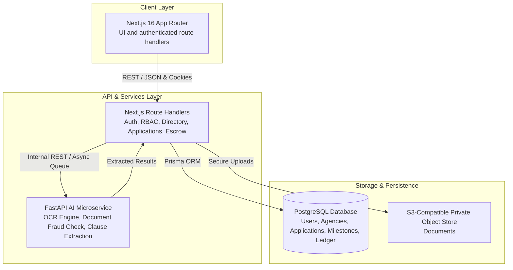

# 🎓 Ethos AI — The Future of Study-Abroad Consulting

[](https://nextjs.org/)
[](https://reactjs.org/)
[](https://www.typescriptlang.org/)
[](https://fastapi.tiangolo.com/)
[](https://www.postgresql.org/)
[](https://www.uiu.ac.bd/)

> **Ethos AI** is a trust-and-payments platform that protects Bangladeshi students and parents from fraudulent study-abroad consultancies through agency verification, transparent pricing, escrow-based milestone payments, and AI-powered document/agreement fraud detection.

---

## 📌 Project Overview & Value Proposition

In Bangladesh, over 70,000–90,000 students apply abroad annually without a mandatory agency licensing regime. Students face predatory upfront fees, hidden charges, forged acceptance letters, and no financial recourse. Ethos AI solves this through 5 core pillars:

1. 🛡️ **Trust Layer:** Verified consultancy directory with license audits, genuine student reviews, and transparent pricing.
2. ⚖️ **Comparison Engine:** Side-by-side agency comparison exposing hidden service fees and refund terms.
3. 🔒 **Milestone Escrow Payments:** Student funds are held securely and released only when verified admission/visa milestones are achieved.
4. 🤖 **AI Fraud & Agreement Detector:** OCR and LLM-powered verification of offer letters, admission claims, and fine-print agreement clauses.
5. 🇧🇩 **Parent-Student Guardian Hub:** Multi-role access allowing parents to monitor application stages and payments with Bangla status summaries.

---

## 🏗️ System Architecture



---

## 👥 Team Members & Task Distribution (Kanban)

See full details in [**`docs/KANBAN.md`**](docs/KANBAN.md) and the [GitHub Projects Board](https://github.com/orgs/Team-Inception-1/projects).

| Name | Role | Core Contributions | GitHub Handle |
|---|---|---|---|
| **Tasin (Lead)** | Full-Stack Architecture Lead + AI/ML | Project architecture, AI microservice integration, Scam-Alert Risk Classifier, AI Agreement Analyzer, AI Tools ↔ Directory live wiring | [`@tasinofficial`](https://github.com/tasinofficial) |
| **Sourav** | AI/ML + Frontend | AI microservice scaffold, OCR fraud detection engine, AI Counselor recommendation engine, Bangla assistant, Neubrutalism UI design system | [`@Souravg223`](https://github.com/Souravg223) |
| **Sudiip** | Backend & Frontend Integration | Auth/RBAC API, application tracking backend, directory & comparison frontend, live API client wiring | [`@SudiipPaul`](https://github.com/SudiipPaul) |
| **Jannat** | QA, Accessibility & Documentation | E2E workflow testing, code quality pass, accessibility audit, demo script, README | [`@jannatferdo`](https://github.com/jannatferdo) |
| **Taha** | Backend & DevOps | Database schema/migrations, escrow ledger engine, real-time chat, API reliability QA, CI/CD pipeline | [`@Taha-Mim-Tasfa`](https://github.com/Taha-Mim-Tasfa) |

> 🤖 **AI/ML ownership:** All AI/ML work (offer-letter fraud OCR, agreement clause analysis, scam-alert classifier, AI Counselor, Bangla assistant) is split exclusively between **Tasin** and **Sourav**. The rest of the team (Sudiip, Jannat, Taha) owns backend, frontend, and QA/DevOps/documentation.

---

## 🚀 Key Implemented Features

### 1. 🔐 User Authentication, RBAC & Guardian Linking (Module 5.1)
- Multi-role access control supporting **Student**, **Parent**, **Agency**, and **Admin**.
- Guardian Account Linking: Parents link to students using a unique link code (`ETHOS-STU-8821`) for synced progress visibility.
- Demo role quick-switcher for immediate interactive evaluation.

### 2. 🏢 Verified Consultancy Directory & Side-by-Side Comparison (Modules 5.2, 5.3 & 5.4)
- Dynamic search and filterable directory (Country, Budget, Success Rate, Rating).
- Interactive side-by-side comparison table for multiple agencies highlighting hidden fees and refund conditions.

### 3. 📂 End-to-End Application Lifecycle Tracking & Document Vault (Modules 5.5 & 5.6)
- Discrete stage machine (`Submitted` → `Under Review` → `Offer Received` → `Payment Pending` → `Visa Processing` → `Completed`).
- Timestamped audit logs for every actor transition and secure document uploads.

### 4. 💳 Milestone Escrow Payment System & Immutable Ledger (Module 5.7)
- Escrow protection preventing full upfront payments. Funds are deposited into milestone escrow and released upon milestone completion.
- Poisha-level integer currency arithmetic and digital transaction receipt generation.

### 5. 🤖 AI Document Fraud Detection & Smart Agreement Analyzer (Modules 5.8 & 5.9)
- Offer letter OCR scanner calculating a 0–100 risk score and flagging template inconsistencies or fraudulent sender domains.
- Agreement clause analyzer extracting fee schedules and identifying predatory terms.

---


## 🛠️ Tech Stack

| Domain | Technology | Description |
|---|---|---|
| **Web and API** | **Next.js 16 App Router, React 19, TypeScript** | UI, Neon Auth sessions, route handlers, RBAC, Prisma repositories |
| **AI / OCR** | **FastAPI (Python 3.12), Tesseract OCR, PyMuPDF** | Offer letter verification, clause analysis, and authenticated risk services |
| **Database** | **PostgreSQL 16, Prisma ORM** | Relational data persistence with strict foreign key integrity |
| **Styling** | **Custom CSS Design Tokens** | Neubrutalism (hard shadows, thick borders, flat color), CSS variables, zero runtime CSS bloat |

---

## 💻 Getting Started (Local Development)

### Prerequisites
- **Node.js**: `v20.x` or higher
- **npm** / **yarn** / **pnpm**
- **Git**

### Installation Steps

1. **Clone the repository:**
   ```bash
   git clone https://github.com/Team-Inception-1/Ethos-AI.git
   cd Ethos-AI
   ```

2. **Install Frontend Dependencies:**
   ```bash
   cd apps/web
   npm install
   ```

3. **Configure Environment Variables:**
   ```bash
   cp .env.example .env.local
   ```

4. **Run the Development Server:**
   ```bash
   npm run dev
   ```
   Open [**http://localhost:3000**](http://localhost:3000) in your browser.

### ⚡ One-Click Launch Script (Windows PowerShell)

Run this directly in PowerShell from the project root to open all 3 services:

Start-Process powershell -ArgumentList "-NoExit", "-Command", "cd 'd:\Ethos AI\Ethos-AI\apps\web'; npm run dev"
Start-Process powershell -ArgumentList "-NoExit", "-Command", "cd 'd:\Ethos AI\Ethos-AI\apps\ai-service'; .\.venv\Scripts\Activate.ps1; uvicorn app.main:app --reload --port 8001"
Start-Process powershell -ArgumentList "-NoExit", "-Command", "cd 'd:\Ethos AI\Ethos-AI'; npx prisma studio"

---

## 📂 Repository Structure

```
Ethos-AI/
├── .agents/                   # Custom agent workflows and skills
├── apps/
│   └── web/                   # Next.js 15 Frontend Web Application
│       ├── public/            # Static assets and images
│       └── src/
│           ├── app/           # App Router pages (login, dashboard, directory, compare, etc.)
│           ├── components/    # Modular UI components (GlassCard, Button, Badge, Navbar)
│           ├── context/       # React Context providers (AuthContext, ThemeContext)
│           └── styles/        # Global design tokens and theme variables
├── docs/
│   ├── ETHOS_AI_CONTEXT.md    # Comprehensive system architectural spec
│   └── KANBAN.md              # Detailed sprint board and task assignments
├── scripts/
│   ├── create_github_issues.ps1 # GitHub Issue creation script (PowerShell)
│   └── create_github_issues.sh  # GitHub Issue creation script (Bash)
└── README.md                  # Project root overview and documentation
```

---

## 🌿 Git Branching & Collaboration Guidelines

We strictly adhere to standard software engineering best practices:
- `main` branch is protected and contains production-ready code.
- Feature work is developed on dedicated branches: `feature/<issue-#>-<short-name>`.
- All pull requests require peer review and approval before merging.
- Commits follow the **Conventional Commits** specification:
  - `feat(scope): new feature`
  - `fix(scope): bug fix`
  - `docs(scope): documentation updates`
  - `refactor(scope): code quality improvements`

---

## 📜 Evaluation Criteria Checklist

- [x] **1. Core Features Implemented:** Auth/RBAC, Verified Directory, Compare Tool, Application Tracker, Escrow Payments, AI Tools.
- [x] **2. Feature Integration & Workflow:** Complete golden flow from search to escrow milestone release and parent tracking.
- [x] **3. Backend / Database Functionality:** Relational schema, DTOs, secure business logic, and API endpoints.
- [x] **4. Git & Team Collaboration:** Distributed commit history, feature branches, clear PR review policy.
- [x] **5. Code Quality & SWE Practices:** Modular directory structure, TypeScript interfaces, error handling, CSS design system.
- [x] **6. UI/UX & Usability:** Responsive Neubrutalism interface, dark/light theme, accessibility labels, feedback states.
- [x] **7. Project Organization & Documentation:** Root README, architecture diagrams, step-by-step setup guide, and sprint Kanban board.
